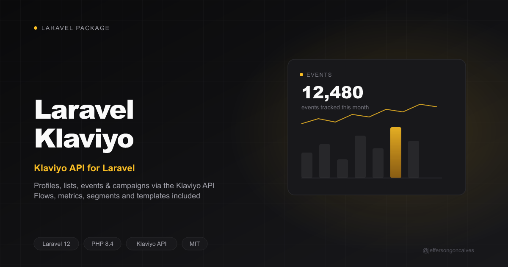

# Laravel Klaviyo

Laravel integration for the Klaviyo API

## Installation

You can install the package via composer:

```bash
composer require jeffersongoncalves/laravel-klaviyo
```

## Configuration

Set your Klaviyo private API key in `.env`:

```env
KLAVIYO_API_KEY=pk_xxxxxxxxxxxxxxxxxxxxxxxxxxxxxxxxxx
```

Optionally publish the config file:

```bash
php artisan vendor:publish --tag="klaviyo-config"
```

## Usage

```php
use Jeffersongoncalves\LaravelKlaviyo\Facades\LaravelKlaviyo;

// Profiles
LaravelKlaviyo::createProfile(['email' => 'user@example.com', 'first_name' => 'Jane']);
LaravelKlaviyo::getProfile($id);
LaravelKlaviyo::updateProfile($id, ['first_name' => 'Jane']);
LaravelKlaviyo::listProfiles(['filter' => 'equals(email,"user@example.com")']);

// Lists
$list = LaravelKlaviyo::createList('Newsletter');
LaravelKlaviyo::addProfilesToList($list['data']['id'], [$profileId]);
LaravelKlaviyo::removeProfilesFromList($list['data']['id'], [$profileId]);
LaravelKlaviyo::deleteList($list['data']['id']);

// Events
LaravelKlaviyo::createEvent('Placed Order', 'user@example.com', ['order_id' => 123], value: 49.90);

// Campaigns, Flows, Metrics, Segments, Templates
LaravelKlaviyo::listCampaigns();
LaravelKlaviyo::listFlows();
LaravelKlaviyo::updateFlow($flowId, 'live');
LaravelKlaviyo::listMetrics();
LaravelKlaviyo::listSegments();
LaravelKlaviyo::listTemplates();
```

All methods throw `Jeffersongoncalves\LaravelKlaviyo\LaravelKlaviyoException` on a failed API response.

## Testing

```bash
composer test
```

## Changelog

Please see [CHANGELOG](CHANGELOG.md) for more information on what has changed recently.

## Contributing

Please see [CONTRIBUTING](CONTRIBUTING.md) for details.

## Security

If you discover any security related issues, please email the author instead of using the issue tracker.

## Credits

- [jeffersongoncalves](https://github.com/jeffersongoncalves)
- [All Contributors](../../contributors)

## License

The MIT License (MIT). Please see [License File](LICENSE.md) for more information.
